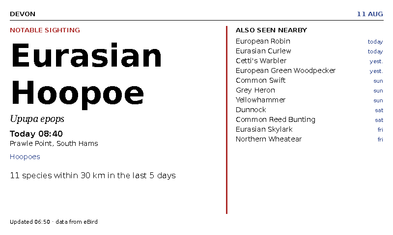
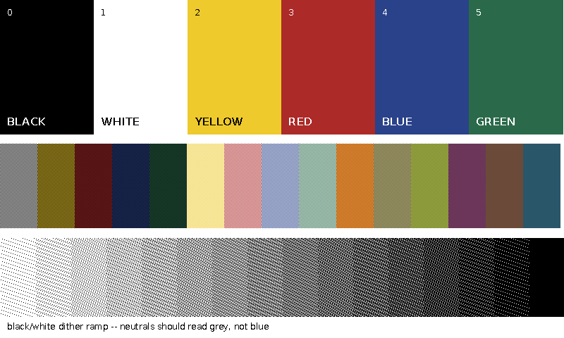

# Bird Watcher

A wall display showing what birds are being seen and heard in the local region
right now, from the public eBird API, on a six-colour e-paper panel: either a
Waveshare 7.3in Spectra 6 driven by a Raspberry Pi Zero 2 WH, or a battery
Pimoroni Inky Frame 7.3in fed by GitHub Actions every two hours.

No personal account data — just what the region is reporting.



*Rendered from the test fixtures. This is the fallback layout, used when no
photograph is available; the usual board puts a dithered 480×480 photo down
the left and this column on the right.*

## How it is put together

Two processes that never call each other, joined by a cache file:

```
fetch.py  →  ~/.cache/birddisplay/cache.json  →  show.py  →  panel
```

The fetcher talks to eBird and Wikimedia and writes a cache. The renderer only
ever reads that cache. If the wifi drops or eBird returns 500s, the panel keeps
showing yesterday's board rather than an error or a blank screen. This split is
the single most important design decision in the project, and the tests enforce
it — `show` is asserted never to open a socket.

The display is behind a one-method interface with three implementations:
`EPaperDisplay` (the panel, importable only on the Pi), `PreviewDisplay`
(writes `preview.png`) and `InkyExportDisplay` (writes the PNG an Inky Frame
fetches over wifi). Every layout decision can therefore be made on a laptop
with a fast feedback loop, which matters because a Spectra 6 full refresh takes
about 30 seconds and has no partial update.

That refresh cost is also a content constraint. The board updates two or three
times a day, so it is designed like a printed page rather than a dashboard: one
photograph, one species named large, and a quiet digest underneath — something
worth looking at for six hours.

## Getting started (no hardware needed)

```bash
git clone https://github.com/edwardraper/Bird-Watcher-.git birddisplay
cd birddisplay
python3 -m venv .venv && . .venv/bin/activate
pip install -e ".[dev]"

export EBIRD_API_KEY=...          # https://ebird.org/api/keygen
python -m scripts.check_api       # verify the key, region and API shapes
python -m birddisplay.fetch -v    # writes the cache
python -m birddisplay.show --preview --scale 2
open preview.png
```

Run `check_api` first. The API clients were written against the documented
response shapes and are tested against recorded fixtures, so this is the step
that confirms those assumptions hold for your key, your region and the live
API — it checks authentication, the region code, the response shape the board
builder depends on, whether `sppLocale` is actually giving you British names,
and the Wikimedia image and attribution path. Anything that is not `ok` comes
with a line saying what to do about it.

Before the first run, set your region in `config.toml`. Confirm the code rather
than assuming it:

```bash
python -m scripts.find_region --parent GB-ENG --match dev
```

`config.toml` also holds the coordinates and radius for the "recent nearby"
query, the refresh cadence assumptions, and — importantly — the `[http]
user_agent`, which must carry real contact details before you point this at
Wikimedia. Their user-agent policy requires it.

## Data sources

**eBird API 2.0** for sightings. Three calls per scheduled fetch: notable
sightings for the region, recent observations near a point, and the taxonomy
(at most once a month, cached to disk — it is ~17k rows and does not change
intra-day). `locale=en_UK` gets British common names, so the board says
"Dunnock" rather than "Hedge Accentor". eBird provides this free and asks
people not to hammer it; the timers add a randomised delay for the same reason.

**Keulemans plates** for the birds that have one, from a SQLite file built
ahead of time — see below. Checked before Wikimedia, because it needs no
network at all.

**Wikimedia Commons** for photographs, via the Wikipedia article for each
species' scientific name. Not Macaulay Library — the licensing there is
per-asset and mostly not ours to use. Every image is cached to
`~/.cache/birddisplay/images/{species_code}.jpg` alongside its artist and
licence, and the credit line is always drawn on the board. That is a licence
condition for most CC images, and it costs one line of 10px text.

## The plate database

`assets/plates/keulemans_uk.sqlite` holds Victorian bird lithographs with
their paper cut away, one row per species, keyed by eBird species code. The
Pi reads it directly:

```sql
SELECT common_name, image FROM plates WHERE species_code = 'eurrob1';
```

John Gerrard Keulemans (1842–1912) drew most of the plates in Lilford's
*Coloured Figures of the Birds of the British Islands* and Dresser's *A
History of the Birds of Europe*, which between them cover essentially every
British bird. He died in 1912, so the lithographs are public domain
worldwide, and Wikimedia Commons has scans of nearly all of them.

They suit this panel far better than photographs do. Six inks and no
partial refresh punish photographic mid-tones; a lithograph is already flat
colour with a drawn outline, which is what the dithering wants. And a plate
that has been cut out sits on the board's own white, so it reads as a print
rather than a pasted-in rectangle — which is what `render/plate_board.py`
is for.

```bash
pip install -e ".[plates]"          # numpy and scipy, build-time only
python -m scripts.build_plate_db --limit 50 -v --report report.json
python -m scripts.plate_board_preview --species eurbla --scale 2
```

Nothing on the Pi imports numpy or scipy or talks to Commons: the build
happens on a laptop and the finished file is committed.

**Cutting the paper away.** The background is not "everything near the
paper colour" — that would eat the white in a gull's wing — but "everything
near the paper colour that is connected to the border". Enclosed whites
survive. The caption then falls out for free: once the paper is gone, the
bird is one big blob and the letters of "ROBIN. *Erithacus rubecula*" are
thirty small ones, so keeping only blobs within a fraction of the largest
throws the text away without ever having to recognise it as text.

**Choosing a plate.** Commons will hand you a Nilgiri blackbird for *Turdus
merula*, a Persian robin for *Erithacus rubecula*, a Thorburn plate from a
book Keulemans also worked on, and a PDF of the whole volume. So identity is
a gate, not a preference: a candidate needs evidence that Keulemans drew it
*and* evidence that it is this bird, or it is skipped. A wrong credit line
is worse than no plate. Ranking only starts once both gates are passed, and
there a plate that cuts to bare paper beats a full painted scene outright —
Keulemans painted landscapes behind the birds in *Onze vogels in huis en
tuin*, and a scene arrives on the board as a dithered rectangle.

`--report` writes what was chosen and why, per species, which is the only
practical way to audit a couple of hundred of these — but the report is not
the check. Look at the pictures: the plate that scored 103 for the moorhen
was a genuine Keulemans drawing of a genuine moorhen, correctly identified,
and it was eight beaks in a row.

What survives that and is still wrong goes in `data/plate_exclusions.json`,
with the reason, and `--update --only <species>` rebuilds one bird without
disturbing the other 44.

## Rendering to six colours

The panel has six inks — black, white, yellow, red, blue, green — and nothing
in between. Two rules make this work:

**Photos are dithered; text never is.** Floyd–Steinberg on 10px text is
unreadable mush. So the canvas is a palettised image from the start: text is
drawn directly into ink indices, and the photo is quantised separately and
pasted in.

**Two palettes, doing two different jobs.** `[palette]` is how the inks *look*,
and is used only to render preview PNGs. `[palette.match]` is what pixels are
compared against when choosing an ink, and is deliberately saturated. This is
not a detail: matching against the muted values the panel really prints drags
every neutral mid-tone onto a coloured ink, because a muted blue sits closer to
mid-grey than black or white does, and photographs come out as red and blue
confetti. Matching against saturated primaries keeps neutrals neutral and
spends ink only where there is colour.

Two scripts exist for tuning, and both are meant to be judged on the panel
rather than on a monitor — screen preview and panel output do not match, and
the panel is the one that counts:

```bash
python -m scripts.dither_lab photo.jpg     # one photo at six enhancement settings
python -m scripts.palette_card             # swatches, two-ink mixes, a grey ramp
python -m scripts.show_image card.png --exact   # on the Pi
```



Photograph the card in the light the display will actually live in, sample the
swatches, and put those values in `[palette]`. Only the preview changes — the
panel is sent ink indices either way. The middle row is every two-ink
checkerboard, which is what dithering actually produces, and tells you more
about mixed tones than the flat swatches do.

## The other hardware path: an Inky Frame

The board also runs on a **Pimoroni Inky Frame 7.3" (Pico 2 W)**, and that
changes where the work happens. The Inky Frame is not a smaller Pi — it is a
microcontroller. No Linux, no CPython, no Pillow, no SQLite, and the plate
database alone is many times its free flash. Nothing in `birddisplay/` can
run on it.

So the split moves. Everything that decides what the board says runs in
GitHub Actions; the frame only fetches a finished picture.

```
Actions, every 2h   fetch.py → cache.json → show.py --backend inky
                                              ↓
                                    board.png + board.json  →  branch `board`
                                              ↓  https
Inky Frame          wake → sha changed? → download → PNG_COPY → refresh → sleep 2h
```

The cache-file boundary the project is built around survives intact: it is
just longer, and made of HTTPS. The frame never talks to eBird, never sees
an API key, and if the download fails it leaves the panel alone — e-ink
holds its last image with no power, so a failure is a board that is a few
hours old rather than an error on the wall.

**The image is a palettised PNG, not a JPEG.** The frame decodes it with
`pngdec` in `PNG_COPY` mode, which copies palette indices straight into the
framebuffer. Every Inky example downloads JPEGs and lets `jpegdec` dither
them, and that would undo the rule this project is built on: text is never
dithered. `INKY_PEN_CODES` in `render/palette.py` reorders our six inks into
PicoGraphics pen order, the same job `WIRE_CODES` does for the Waveshare
panel.

Setup is in [`firmware/inky_frame/README.md`](firmware/inky_frame/README.md).
To see exactly what the frame will draw:

```bash
python -m birddisplay.show --backend inky --preview-path board.png
```

## Pi setup

```bash
sudo raspi-config nonint do_spi 0
sudo apt update
sudo apt install -y python3-pil python3-numpy python3-gpiozero python3-spidev \
                    fonts-dejavu-core fonts-liberation2 git

git clone https://github.com/edwardraper/Bird-Watcher-.git ~/birddisplay
python3 -m venv --system-site-packages ~/.venvs/birddisplay
~/.venvs/birddisplay/bin/pip install requests

printf 'EBIRD_API_KEY=%s\n' "$YOUR_KEY" | sudo tee /etc/birddisplay.env
sudo chmod 600 /etc/birddisplay.env

sudo cp systemd/birddisplay-*.{service,timer} /etc/systemd/system/
sudo systemctl daemon-reload
sudo systemctl enable --now birddisplay-fetch.timer birddisplay-show.timer
```

`--system-site-packages` is what lets the venv see the apt-installed Pillow and
numpy, which are prebuilt for ARM and save a very long compile.

The Waveshare driver is vendored in `birddisplay/vendor/` — two files rather
than a dependency on the whole e-Paper tree, so deployments are reproducible.
It is used through a wrapper that never calls the driver's `getbuffer()`: that
method re-quantises with dithering, which would shred our text. We pack the
4-bit buffer ourselves instead.

**The panel is always put back to sleep**, from a `finally` block, even if the
refresh raises. Leaving a Spectra 6 powered in its active state is the main way
people damage them.

### Schedule

| Timer | Fires |
|---|---|
| `birddisplay-fetch.timer` | 06:50, 12:50, 18:50, and 2 min after boot |
| `birddisplay-show.timer` | 07:00, 13:00, 19:00, and 4 min after boot |

Ten minutes apart so the render always reads a cache written this cycle.
`Persistent=true` means a run missed while the Pi was off fires on next boot.
Refreshing three times daily also satisfies Waveshare's advice to drive the
panel at least once every 24 hours, which keeps ghosting from setting in.

```bash
journalctl -u birddisplay-fetch -n 50
systemctl list-timers 'birddisplay-*'
```

## When things go wrong

This lives on a wall and nobody is watching it, so the failure paths are the
interesting ones:

- Every HTTP call has a 10s timeout and three retries with exponential backoff.
  A 500 or a dropped connection is retried; a 403 from a bad API key fails
  immediately, because it will fail the same way on the second attempt.
- The cache is written atomically (temp file, `os.replace`), so a crash or a
  power cut mid-write cannot corrupt it.
- A board older than `[cache].max_age_hours` still renders, but carries a red
  `DATA STALE` marker. Week-old sightings are never presented as current.
- If no photograph can be found for any candidate species, the board falls back
  to a full-width text layout that is laid out to look deliberate — not a
  degraded version of the photo board, since it may be up for six hours.
- If the fetcher fails entirely, it exits non-zero (so `systemctl status` shows
  it) and leaves the previous cache untouched.

## Development

```bash
python -m pytest              # 175 tests, no network, no hardware
```

The eBird responses in `tests/fixtures/` are hand-built from the real API
shapes. Hardware behaviour is tested against a fake driver that records the
call sequence — including that the panel sleeps even when the refresh throws.
The frame's firmware is MicroPython and cannot be imported here, so its
hardware modules are stubbed and the one thing worth testing is: given this
manifest and this saved state, did it refresh the panel?

```
birddisplay/
├── config.py            # load + validate config.toml, API key from env
├── model.py             # Sighting, Species, Photo, Board
├── cache.py             # atomic writes, staleness, featured-species memory
├── sources/             # ebird, taxonomy, images, plates, HTTP client
├── render/              # palette, fonts, layout, plate_board
├── display/             # Display protocol, epaper, preview, inky_export
├── vendor/              # Waveshare epd7in3e + epdconfig, unmodified
├── fetch.py             # entrypoint: refresh the cache
└── show.py              # entrypoint: draw the cache
```

## Licence

MIT, except `birddisplay/vendor/`, which is Waveshare's driver code under its
own MIT licence. Bird photographs are Wikimedia Commons contributors' work
under their individual licences, credited on the board.
